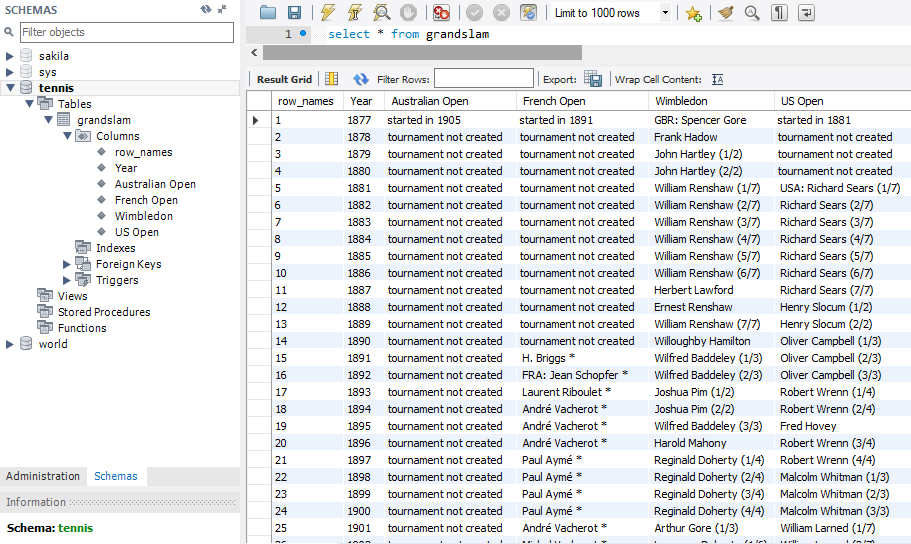

```{r setup, include=FALSE}
knitr::opts_chunk$set(echo = TRUE)
```

#Project 2

```{r}
library(stringr)
library(rvest)
library(dplyr)
library(tidyr)
library(kableExtra)
library(ggplot2)
library("RMySQL")
```


##Dataset 1
###Wiki - List of Grand Slam men's singles champions by Peter Kowalchuk

 https://en.wikipedia.org/wiki/List_of_Grand_Slam_men%27s_singles_champions                       
 
The wiki page for the List of Grand Slam men's singles champions shows a table with a list of all the winners of Grand Slam tournaments. It can be found at this url: https://en.wikipedia.org/wiki/List_of_Grand_Slam_men%27s_singles_champions    

The table has 5 columns. The first is the year, and the following 4 are one for each Grand Slam tournament. Each row on the table constitutes an entry for the results, winner, for each of the four grand slam tournaments. If we revisit the guideline of what a tidy table is, we can quickly see that this table does not comply with such approach. In tidy, we should have columns for each variable, and the rows should represent observation entries. That is clearly not the case, as the column represent an actual characteristic of the observation. Observations being in this case the results of each tournament. On the table shown in wiki, there are columns for the tournament names, which breaks the tidy framework.       

To have a tidy compliant table, we should have columns for variables. This can be achieved by setting our columns to: year, tournament name, player name. With these simple three columns, we can not enter on each row the results for each tournament. In fact, we could break out some of the information on the original table cells to add more columns with variables. For example, we could add another column with the player's country, and another with the tournaments location. With this structure, we would add a row to the table each time a tournament is completed and the winner is known. We could even add other tournaments beyond Grand Slams like ATP Master tournaments. Another column that might be added is an identifier for the kind of tournament, tournament type for example. This might show GS for the original tournaments in wiki, and maybe ATPM for ATP Masters, EX for exhibition games, and so on.               

But even with the original data in wiki, we can now do a lot more with the table in this new tidy form. We can for instance group rows in the table per country of winning player and calculate which country has won more tournaments. We can do the same with player names. We can also filter by tournament and run the same grouping and quickly know who has won specific tournaments the most. Knowing Wimbledon is played on grass and the French Open in clay, we can also know which country has the best clay or grass players, or which player specifically is better at a given surface.                  

By arranging the table into a tidy format, we are now able to extract a great amount of information from the same data presented in the original table. And on top of that we are able to expand the table to new tournaments or observations, and add characteristics or variables of these tournaments very easily. Not only is the table easier to use with existing data, we can now expand the tale beyond the data original contained in it.             

```{r}
url<-'https://en.wikipedia.org/wiki/List_of_Grand_Slam_men%27s_singles_champions'
webPage<- url %>% read_html()
#Using the selectorgadget in chrome we find the CSS selector to bring in the table as a vector
#The table in the html page is anot a clean table with cells so scrapping it with a table tag is not the right approach
vectorTable<-webPage %>% html_nodes('tr td') %>% html_text()
#build vector with string elements for each year
years<-paste(c(1877:2018))
#we trim vectorTable to be the size of the table if the table had names for all its rows
vectorTable<-vectorTable[1:(length(years)*5)]
#we find that the resulting vector includes elements which go bejond the table
#we trim the vector down to just the elements on the table
#find element position for each year in vectorTable, this tells us where the rows are
m<-match(years,vectorTable)
#find number of elements between years, if all 4 tournament data is present, then differene should be 5
#this tells us where the rows with complete data are
n<-diff(m)
#we copy all the years with complete tournament data on to a new vector 
x<-c()
i<-1
for (nn in n) {if (n[i]==5) {x<-c(x,vectorTable[m[i]:(m[i]+4)])}; i<-i+1}
x<-c(x,vectorTable[m[i]:(m[i]+4)])
#we copy the resulting vector with al the table rows with data on to a data frame using the new tidy table format -this is still a wide table
tblTable<-tbl_df(as.data.frame(matrix(x,nrow=length(x)/5,ncol=5,byrow = TRUE)))
#we assign proper column names to the data frame
tblTable<-setNames(tblTable,c('Year','Australian Open','French Open','Wimbledon','US Open'))
tblTable %>% kable() %>% kable_styling() %>% scroll_box(width = "910px", height = "400px")

#we save the table to a csv file
write.csv(tblTable,file="grandSlamWinners.csv",row.names=FALSE)
#we can read this csv file
tblTable<-tbl_df(read.csv(file="grandSlamWinners.csv", header=TRUE, sep=",",colClasses = "character"))
tblTable<-setNames(tblTable,c('Year','Australian Open','French Open','Wimbledon','US Open'))

#we can also connect to a mySQL server and write the table there
#in mySQL we create a schema for our table and then we can write and read the table
mydb<-dbConnect(MySQL(),user='root',password='1234',dbname='tennis',host='localhost')
dbWriteTable(mydb, value = tblTable, name = "grandSlam")
sqlTable<-dbReadTable(mydb,"grandSlam")
sqlTable %>% kable() %>% kable_styling() %>% scroll_box(width = "910px", height = "400px")
```



```{r}
#Now that we have a a wide table we build our tidy table using gather
tidyTable<-gather(tblTable,"Tournament","Player",2:5)
#we do some heavy lifting to clean each cell
tidyTable$Player<-str_extract(tidyTable$Player,"[A-Z][:alpha:]+ [A-Z]'[A-Z][:alpha:]+ [:alpha:]+|[A-Z][:alpha:]+ [A-Z][:alpha:]+|[A-Z]\\. [:alpha:]+")
tidyTable$Player[tidyTable$Player=="World War"]<-NA
tidyTable$Player[tidyTable$Player=="Tournament date"]<-NA
tidyTable<-tidyTable %>% na.omit()
tidyTable %>% kable() %>% kable_styling() %>% scroll_box(width = "910px", height = "400px")
```


###Dataset Analysis

###Players with most wins

```{r fig.width=10}
tidyTable %>% group_by(Player) %>% summarise(Total_Wins=n())  %>% arrange(desc(Total_Wins)) %>% kable() %>% kable_styling() %>% scroll_box(width = "910px", height = "400px")
tidyOrder<-tidyTable %>% group_by(Player) %>% summarise(Total_Wins=n()) %>% top_n(50)
tidyOrder$Player<-factor(tidyOrder$Player,levels = tidyOrder$Player[order(-tidyOrder$Total_Wins)])
ggplot(data=tidyOrder,aes(x=Player, y=Total_Wins))+geom_bar(stat = "identity")+theme(axis.text = element_text(angle=90))+ggtitle("Top 50 Grand Slam Winners") 
```

###Australian Open players with most wins

```{r fig.width=10}
tidyOrder<-tidyTable %>% filter(Tournament=="Australian Open") %>% group_by(Player) %>% summarise(Total_Wins=n())   
tidyOrder %>% arrange(desc(Total_Wins)) %>% kable() %>% kable_styling() %>% scroll_box(width = "910px", height = "400px")

tidyOrder<-tidyOrder %>% top_n(50)
tidyOrder$Player<-factor(tidyOrder$Player,levels = tidyOrder$Player[order(-tidyOrder$Total_Wins)])
ggplot(data=tidyOrder,aes(x=Player, y=Total_Wins))+geom_bar(stat = "identity")+theme(axis.text = element_text(angle=90))+ggtitle("Top 50 Australian Open Players") 
```

###French Open players with most wins

```{r fig.width=10}
tidyOrder<-tidyTable %>% filter(Tournament=="French Open") %>% group_by(Player) %>% summarise(Total_Wins=n()) 
tidyOrder %>% arrange(desc(Total_Wins)) %>% kable() %>% kable_styling() %>% scroll_box(width = "910px", height = "400px")

tidyOrder<-tidyOrder %>% top_n(50)
tidyOrder$Player<-factor(tidyOrder$Player,levels = tidyOrder$Player[order(-tidyOrder$Total_Wins)])
ggplot(data=tidyOrder,aes(x=Player, y=Total_Wins))+geom_bar(stat = "identity")+theme(axis.text = element_text(angle=90))+ggtitle("Top 50 French Open Players") 
```

###Wimbledon players with most wins

```{r fig.width=10}
tidyOrder<-tidyTable %>% filter(Tournament=="Wimbledon") %>% group_by(Player) %>% summarise(Total_Wins=n())
tidyOrder %>% arrange(desc(Total_Wins)) %>% kable() %>% kable_styling() %>% scroll_box(width = "910px", height = "400px")

tidyOrder<-tidyOrder %>% top_n(50)
tidyOrder$Player<-factor(tidyOrder$Player,levels = tidyOrder$Player[order(-tidyOrder$Total_Wins)])
ggplot(data=tidyOrder,aes(x=Player, y=Total_Wins))+geom_bar(stat = "identity")+theme(axis.text = element_text(angle=90))+ggtitle("Top 50 Wimbledon Players") 
```

###US Open players with most wins

```{r fig.width=10}
tidyOrder<-tidyTable %>% filter(Tournament=="US Open") %>% group_by(Player) %>% summarise(Total_Wins=n())  
tidyOrder %>% arrange(desc(Total_Wins)) %>% kable() %>% kable_styling() %>% scroll_box(width = "910px", height = "400px")

tidyOrder<-tidyOrder %>% top_n(50)
tidyOrder$Player<-factor(tidyOrder$Player,levels = tidyOrder$Player[order(-tidyOrder$Total_Wins)])
ggplot(data=tidyOrder,aes(x=Player, y=Total_Wins))+geom_bar(stat = "identity")+theme(axis.text = element_text(angle=90))+ggtitle("Top 50 US Open Players") 
```

###Most dominant players in the 90's

```{r fig.width=10}
tidyOrder<-tidyTable %>% filter(Year %in% paste(seq(1990,1999,1))) %>% group_by(Player) %>% summarise(Total_Wins=n())  
tidyOrder  %>% arrange(desc(Total_Wins)) %>% kable() %>% kable_styling() %>% scroll_box(width = "910px", height = "400px")

tidyOrder$Player<-factor(tidyOrder$Player,levels = tidyOrder$Player[order(-tidyOrder$Total_Wins)])
ggplot(data=tidyOrder,aes(x=Player, y=Total_Wins))+geom_bar(stat = "identity")+theme(axis.text = element_text(angle=90))+ggtitle("Most Dominat Players in the 90's") 
```

###Most dominant player per decade

```{r fig.width=10}
tidyCase<-tidyTable %>% mutate(Decade=paste(substr(Year,1,3),"0's",sep = "")) %>% group_by(Decade,Player) %>% summarise(Total_Wins=n()) %>% filter(Total_Wins==max(Total_Wins))  
tidyCase %>% arrange(desc(Total_Wins)) %>% kable() %>% kable_styling() %>% scroll_box(width = "910px", height = "400px")

tidyOrder<-tidyCase %>% mutate(PlayerDecade=paste(Player,Decade,sep = " in the "))
tidyOrder$PlayerDecade<-factor(tidyOrder$PlayerDecade,levels = tidyOrder$PlayerDecade[order(-tidyOrder$Total_Wins)])
ggplot(data=tidyOrder,aes(x=PlayerDecade, y=Total_Wins))+geom_bar(stat = "identity")+theme(axis.text = element_text(angle=90))+ggtitle("Most Dominat player per decade")
```

###Best players by surface

```{r fig.width=10}
tidyCase<-tidyTable %>% mutate(Surface=ifelse(Tournament=="Wimbledon","Grass",ifelse(Tournament=="French Open","Clay",ifelse(Tournament=="Australian Open" & strtoi(Year)<1988,"Grass",ifelse(Tournament=="Australian Open" & strtoi(Year)>1987,"Hard Court",ifelse(Tournament=="US Open" & strtoi(Year)<1975,"Grass",ifelse(Tournament=="US Open" & strtoi(Year)>1974 & strtoi(Year)<1978,"Clay",ifelse(Tournament=="US Open" & strtoi(Year)>1977,"Hard Court",NA))))))))
tidyCase %>% kable() %>% kable_styling() %>% scroll_box(width = "910px", height = "400px")

tidyOrder<-tidyCase %>% group_by(Surface,Player) %>% summarise(Total_Wins=n()) #%>% filter(Total_Wins==max(Total_Wins)) 
tidyOrder %>% arrange(desc(Total_Wins)) %>% kable() %>% kable_styling() %>% scroll_box(width = "910px", height = "400px")

tidyOrder<-tidyOrder %>% mutate(PlayerSurface=paste(Player,Surface,sep = " on "))
tidyOrder$PlayerSurface<-factor(tidyOrder$PlayerSurface,levels = tidyOrder$PlayerSurface[order(-tidyOrder$Total_Wins)])
tidyOrder %>% filter(Total_Wins==max(Total_Wins)) %>% ggplot(aes(x=PlayerSurface, y=Total_Wins))+geom_bar(stat = "identity")+theme(axis.text = element_text(angle=90))+ggtitle("Best player by surface") 

```

###Adding ATP tournamets to table

```{r fig.width=10}
url<-'https://en.wikipedia.org/wiki/ATP_World_Tour_Masters_1000'
webPage<- url %>% read_html()
vectorTable<-webPage %>% html_nodes('th') %>% html_text()
tableHeaderPositions<-which("Indian Wells"==vectorTable)
tableHeaderLengths<-diff(tableHeaderPositions)
tableHeaders<-c()
j<-seq(1:(length(tableHeaderPositions)-1))
for (i in j) {
  tableHeaders[[i]]<-vectorTable[(tableHeaderPositions[i]):((tableHeaderPositions[i])+tableHeaderLengths[i]-2)]
}
i<-i+1
tableHeaders[[i]]<-vectorTable[(tableHeaderPositions[i]):((tableHeaderPositions[i])+10)]
vectorTable<-webPage %>% html_nodes('td') %>% html_text()

getMastersTable<-function(endYear,startYear) {
  years<-paste(c(endYear:startYear))
  m<-match(years,vectorTable)
  n<-diff(m)
  #we copy all the years with complete tournament data on to a new vector 
  x<-c()
  i<-1
  for (nn in n) {x<-c(x,vectorTable[m[i]:(m[i]+(nn-1))]); i<-i+1}
  x<-c(x,vectorTable[m[i]:(m[i]+(nn-1))])
  tblTable<-tbl_df(as.data.frame(matrix(x,nrow=length(x)/10,ncol=10,byrow = TRUE)))
  tblTable<-setNames(tblTable,c('Year',tableHeaders[[1]]))
  tidyTableMasters<-gather(tblTable,"Tournament","Player",2:10)
  tidyTableMasters$Player<-str_extract(tidyTableMasters$Player," [:alpha:][:alpha:]+")
  tidyTableMasters<-tidyTableMasters %>% na.omit()
  return(mutate(tidyTableMasters,Tournament_Type='Masters'))
}
tidyTableMasters<-getMastersTable(2018,2011)

#we clean the original Grand Slam table to only show last names so we can use it together with the Masters table
tidyTable$Player<-str_extract(tidyTable$Player," [A-Z][:alpha:]+")
tidyTable<-mutate(tidyTable,Tournament_Type='Grand Slam')
tidyTableAll<-full_join(tidyTable,tidyTableMasters)
tidyTableAll %>% kable() %>% kable_styling() %>% scroll_box(width = "910px", height = "400px")

tidyTableAll<-full_join(tidyTableAll,getMastersTable(2010,2009))
tidyTableAll<-full_join(tidyTableAll,getMastersTable(2008,2004))
tidyTableAll<-full_join(tidyTableAll,getMastersTable(2003,2002))
tidyTableAll<-full_join(tidyTableAll,getMastersTable(2001,2000))
tidyTableAll<-full_join(tidyTableAll,getMastersTable(1999,1996))
tidyTableAll<-full_join(tidyTableAll,getMastersTable(1995,1990))

tidyTableAll %>% kable() %>% kable_styling() %>% scroll_box(width = "910px", height = "400px")
```

###Players with most overall wins

```{r fig.width=10}
tidyTableAll %>% group_by(Player) %>% summarise(Total_Wins=n())  %>% arrange(desc(Total_Wins)) %>% kable() %>% kable_styling() %>% scroll_box(width = "910px", height = "400px")
tidyOrder<-tidyTableAll %>% group_by(Player) %>% summarise(Total_Wins=n()) %>% top_n(50)
tidyOrder$Player<-factor(tidyOrder$Player,levels = tidyOrder$Player[order(-tidyOrder$Total_Wins)])
ggplot(data=tidyOrder,aes(x=Player, y=Total_Wins))+geom_bar(stat = "identity")+theme(axis.text = element_text(angle=90))+ggtitle("Top 50 Overall Winners") 
```

##Data set 2
###Untidy data - airline safety by Ravi Itwaru 

https://raw.githubusercontent.com/fivethirtyeight/data/master/airline-safety/airline-safety.csv                

Below is a dataset I found on airline safety. We can perform some analyst on this data to find out which airlines had the worst record on fatalities and incidents.                  

```{r}
#load csv data from github into a table
library(RCurl)
csvTable<-tbl_df(read.csv(text = getURL("https://raw.githubusercontent.com/fivethirtyeight/data/master/airline-safety/airline-safety.csv  ")))
csvTable %>% kable() %>% kable_styling() %>% scroll_box(width = "910px", height = "400px")

#we save the table to a csv file
write.csv(csvTable,file="airline-safety.csv",row.names = FALSE)
csvTable<-tbl_df(read.csv(file="airline-safety.csv", header=TRUE, sep=",",colClasses = "character"))

#with the data now in a data frame in R, we build our tidy table
#first we go from wide to tidy by creating a column for variables Type and # of Incidents
tidyTable<-csvTable %>% gather("Type","Incidents",3:8)
#second we split the incident column becouse it also contains info of the period of the observation
tidyTable<-tidyTable %>% sapply( function(x) str_replace(x,"s_","s-"),USE.NAMES = FALSE)
#we create a new period column so that each column is a separate variable
tidyTable<-tbl_df(tidyTable) %>% separate(Type,sep = "-",c('Type','Period'))
tidyTable %>% kable() %>% kable_styling() %>% scroll_box(width = "910px", height = "400px")

```

###Airlines with most incidents
```{r fig.width=10}
tidyOrder<-tidyTable %>% group_by(airline) %>% summarise(Total_Incidents=sum(strtoi(Incidents)))  %>% arrange(desc(Total_Incidents))
tidyOrder %>% kable() %>% kable_styling() %>% scroll_box(width = "910px", height = "400px")
tidyOrder$airline<-factor(tidyOrder$airline,levels = tidyOrder$airline[order(-tidyOrder$Total_Incidents)])
ggplot(data=tidyOrder,aes(x=airline, y=Total_Incidents))+geom_bar(stat = "identity")+theme(axis.text = element_text(angle=90))+ggtitle("Airlines with most Incidents") 
```

###Airlines with most fatal incidents
```{r fig.width=10}
tidyOrder<-tidyTable %>% filter(Type=='fatal_accidents') %>% group_by(airline) %>% summarise(Total_Incidents=sum(strtoi(Incidents)))  %>% arrange(desc(Total_Incidents))
tidyOrder %>% kable() %>% kable_styling() %>% scroll_box(width = "910px", height = "400px")
tidyOrder$airline<-factor(tidyOrder$airline,levels = tidyOrder$airline[order(-tidyOrder$Total_Incidents)])
ggplot(data=tidyOrder,aes(x=airline, y=Total_Incidents))+geom_bar(stat = "identity")+theme(axis.text = element_text(angle=90))+ggtitle("Airlines with most Fatal Incidents") 
```

###Airlines with most normalized incidents
```{r fig.width=10}
tidyOrder<-tidyTable %>% group_by(airline) %>% summarise(Total_IncidentsPERavail_seat_km_per_week=sum(as.numeric(Incidents))/(sum(as.numeric(avail_seat_km_per_week))/n()))  %>% arrange(desc(Total_IncidentsPERavail_seat_km_per_week))
tidyOrder %>% kable(digits = 10) %>% kable_styling() %>% scroll_box(width = "910px", height = "400px")
tidyOrder$airline<-factor(tidyOrder$airline,levels = tidyOrder$airline[order(-tidyOrder$Total_IncidentsPERavail_seat_km_per_week)])
ggplot(data=tidyOrder,aes(x=airline, y=Total_IncidentsPERavail_seat_km_per_week))+geom_bar(stat = "identity")+theme(axis.text = element_text(angle=90))+ggtitle("Airlines with most Normalized Incidents") 
```

###Airlines with most normalized fatal incidents
```{r fig.width=10}
tidyOrder<-tidyTable %>% filter(Type=='fatal_accidents') %>% group_by(airline) %>% summarise(Total_IncidentsPERavail_seat_km_per_week=sum(as.numeric(Incidents))/(sum(as.numeric(avail_seat_km_per_week))/n()))  %>% arrange(desc(Total_IncidentsPERavail_seat_km_per_week))
tidyOrder %>% kable(digits = 10) %>% kable_styling() %>% scroll_box(width = "910px", height = "400px")
tidyOrder$airline<-factor(tidyOrder$airline,levels = tidyOrder$airline[order(-tidyOrder$Total_IncidentsPERavail_seat_km_per_week)])
ggplot(data=tidyOrder,aes(x=airline, y=Total_IncidentsPERavail_seat_km_per_week))+geom_bar(stat = "identity")+theme(axis.text = element_text(angle=90))+ggtitle("Airlines with most Normilized Fatal Incidents") 
```


##Data set 3
###Untidy Data by Corey Arnouts 

https://en.wikipedia.org/wiki/College_football                   

On the college football wikipedia page there is a historical college football scoring datatable that indicates the different ways to score points in college football throughout the evolution of the game. This would be an interesting data table to extract and then see if you could find final scores of games from those time periods and compare the two tables and see what the correlation between the two is.     

```{r}
#first we scrappe the table from the wiki site
url<-'https://en.wikipedia.org/wiki/College_football'
webPage<- url %>% read_html()
vectorTable<-webPage %>% html_nodes('tr th') %>% html_text()
tableHeader<-vectorTable[1:8]
vectorTable<-webPage %>% html_nodes('tr td') %>% html_text() %>% str_replace("present",format(Sys.Date(), "%Y"))
tableData<-vectorTable[1:(8*8)]
tblTable<-tbl_df(as.data.frame(matrix(tableData,nrow=length(tableData)/length(tableHeader),ncol=length(tableHeader),byrow = TRUE)))
tblTable<-setNames(tblTable,tableHeader)
tblTable %>% kable() %>% kable_styling() %>% scroll_box(width = "910px", height = "400px")

#we save the table to a csv file
#write.csv(tblTable,file="college_football.csv",row.names = FALSE)
#we can read this csv file  --  note: knitt in windows did not handle emdash in table. emdash was replaced manually in csv file with endash. knitt had no issues on Mac
tblTable<-tbl_df(read.csv(file="college_football.csv", header=TRUE, sep=",",colClasses = "character"))
tblTable<-setNames(tblTable,tableHeader)

#we convert the wide table into a tidy table
tidyTable<-gather(tblTable,"Play","Points",2:length(tableHeader))
tidyTable %>% kable() %>% kable_styling() %>% scroll_box(width = "910px", height = "400px")

#we split the Era column into Year_start and Year_End
tidyTable<-tbl_df(tidyTable)
tidyTable<-tidyTable %>% separate(Era,sep = "-",into = c('Start_Year','End_YearTemp')) 
tidyTable<-tidyTable %>% mutate(End_Year=coalesce(End_YearTemp,Start_Year)) %>% select(c(Start_Year,End_Year,Play,Points))  
tidyTable<-tidyTable %>% sapply( function(x) toupper(x),USE.NAMES = FALSE)
tidyTable<-tbl_df(tidyTable)
tidyTable %>% kable() %>% kable_styling() %>% scroll_box(width = "910px", height = "400px")
```


Now that we have a tidy table we can start comparing games as if they were played in different eras.

### 2018 Super Bowl: Eagles vs Patriots

We will use this table to determine if the 2018 Super Bowl would have been won if it was played using the scoring system in effect in 1883

```{r}
#We screpe the plays of this game from the ESPN website
url<-'http://www.sportingnews.com/us/nfl/news/philadelphia-eagles-new-england-patriots-score-updates-results-highlights-super-bowl-52/1obg36rfzvjkw170ws1sxy2tcl'
webPage<- url %>% read_html()
vectorPlays<-webPage %>% html_nodes('strong') %>% html_text()
vectorPlays<-vectorPlays[3:length(vectorPlays)]
#kick conversions after touchdown are added manually since they are not recorded on the web site
vectorPlays<-c(vectorPlays,"CONVERSION (KICK), Eagles","CONVERSION (KICK), Eagles","CONVERSION (KICK), Patriots","CONVERSION (KICK), Patriots","CONVERSION (KICK), Patriots") 
vectorPlays

getTeamPlayPoints<-function(GameYear,TeamName) {
  GameYear
  vectorTeamPlays<-str_extract(vectorPlays,paste(" [A-Z]+, ",TeamName,"| [A-Z]+ [A-Z]+, ",TeamName,"|[A-Z]+ \\([^()]+\\), ",TeamName,sep = "")) %>% str_extract("[A-Z]+ \\([^()]+\\)|[A-Z]+ [A-Z]+|[A-Z]+")
  vectorTeamPlays<-vectorTeamPlays[!is.na(vectorTeamPlays)]
  tablePlays<-tbl_df(data.frame(matrix(vectorTeamPlays,nrow=length(vectorTeamPlays),ncol=1,byrow=TRUE)))
  tablePlays<-setNames(tablePlays,"Play")
  #We select only 2018 rows from tidyTable and then do a join with the eagle plays table
  tidyTableFiltered<-tidyTable %>% filter(End_Year==GameYear) 
  return(inner_join(tablePlays,tidyTableFiltered))
}

tableEaglePlaysPoints<-getTeamPlayPoints("2018","Eagles")
tableEaglePlaysPoints %>% kable() %>% kable_styling() %>% scroll_box(width = "910px", height = "400px")
totalEaglePoints2018<-sum(strtoi(tableEaglePlaysPoints$Points))
print(paste("Eagles Score with 2018 scoring: ",toString(totalEaglePoints2018)))
game<-c("Super Bowl")
year<-c("2018")
team<-c("Eagles")
scoring_sys<-c("2018")
score<-c(totalEaglePoints2018)

tablePatriotsPlaysPoints<-getTeamPlayPoints("2018","Patriots")
tablePatriotsPlaysPoints %>% kable() %>% kable_styling() %>% scroll_box(width = "910px", height = "400px")
totalPatriotsPoints2018<-sum(strtoi(tablePatriotsPlaysPoints$Points))
print(paste("Patriots Score with 2018 scoring: ",toString(totalPatriotsPoints2018)))
game<-c(game,"Super Bowl")
year<-c(year,"2018")
team<-c(team,"Patriots")
scoring_sys<-c(scoring_sys,"2018")
score<-c(score,totalPatriotsPoints2018)

tableEaglePlaysPoints<-getTeamPlayPoints("1883","Eagles")
tableEaglePlaysPoints %>% kable() %>% kable_styling() %>% scroll_box(width = "910px", height = "400px")
totalEaglePoints1883<-sum(strtoi(tableEaglePlaysPoints$Points))
print(paste("Eagles Score with 1883 scoring: ",toString(totalEaglePoints1883)))
game<-c(game,"Super Bowl")
year<-c(year,"2018")
team<-c(team,"Eagles")
scoring_sys<-c(scoring_sys,"1883")
score<-c(score,totalEaglePoints1883)

tablePatriotsPlaysPoints<-getTeamPlayPoints("1883","Patriots")
tablePatriotsPlaysPoints %>% kable() %>% kable_styling() %>% scroll_box(width = "910px", height = "400px")
totalPatriotsPoints1883<-sum(strtoi(tablePatriotsPlaysPoints$Points))
print(paste("Patriots Score with 1883 scoring: ",toString(totalPatriotsPoints1883)))
game<-c(game,"Super Bowl")
year<-c(year,"2018")
team<-c(team,"Patriots")
scoring_sys<-c(scoring_sys,"1883")
score<-c(score,totalPatriotsPoints1883)

results<-data.frame(game,year,team,scoring_sys,score)
results<-tbl_df(results)
results %>% kable() %>% kable_styling() %>% scroll_box(width = "910px")
results %>% group_by(scoring_sys) %>% ggplot(aes(x=team,y=score,fill=scoring_sys))+geom_bar(stat = "identity",position = 'dodge')

print("2018 vs 1883 resluts")
print(paste("2018: Eagles ",toString(totalEaglePoints2018),"vs Patriots ",toString(totalPatriotsPoints2018)))
print(paste("1883: Eagles ",toString(totalEaglePoints1883),"vs Patriots ",toString(totalPatriotsPoints1883)))
```

Eagles would have still defeted the Patriots if 1883 football scoring rules were still in effect, although by a smaller margin.
